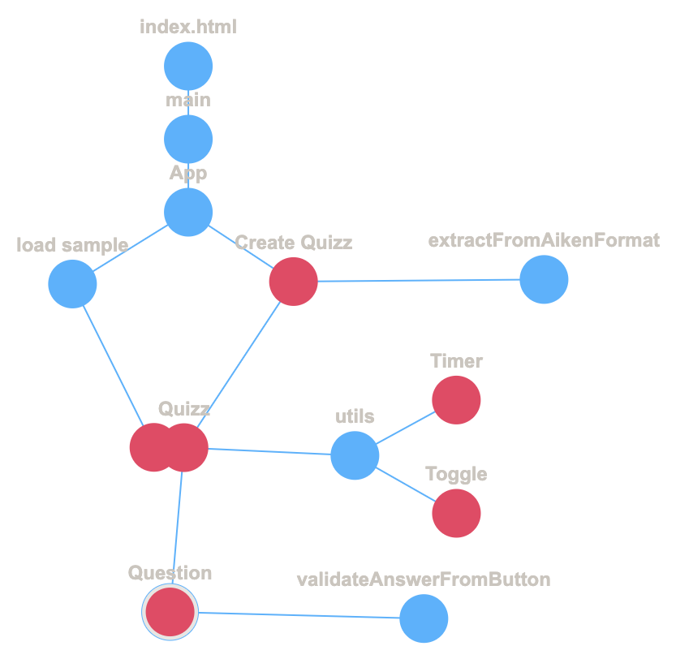

# Quiz App 

# Did

- basic app that loads sample data
- can check answers when the answer is index with number or alphabet
- can extract questions from AikenFormat
- a create quiz page
- a toggle and timer component
- Actually working one will start using this and build more on it

# Do

- If show score at last use use radio button else use normal button
- View Score or consecutive test -> next test will only contain wrong answered
- Do random later first right flow
- Add sound for timer
- A start quizz maybe and in that we can choose show answer at last or not.
- a resizer
-

# Learning

- Don't use set State inside a component without any triggers like on click; will stuck in the loop since every set rerender the component.
- What's the difference between button and normal div-> a11y keydown will be handled.
- In setstate `i++` won't work
  - `i++` POST return the original value and increment it -> So the sate assigned is same but if the index; but will assign right value if index is used somewhere, but the index state is used in any react component append check it won't work.
  - `++i` will work PRE

* While passing objects to a react component, don't pass the whole object, pass it every key value pair mentioned in the object.
* `rem` in CSS don't know what but in ref to root element. I think it will be used on react apps and it have mobile too. Auto?
* CSS transitions do not work with changes in display property.
* justify-content: space-between;

# Color

- blue/green hues improve recall, while red increases attention but not memory.

# for flow Diagram

- https://tree-tool.netlify.app/
  

# For Development

- The question Id should not be stored, I should be generated on app load starting from `1`. or just index+1.
- The option Id is `QuestionID`+"\_"+`option_label`
- The option label should be again created on app load and always upper case alphabet starting from `A`.
- The question Ids and option should be maintained within the quizz component
- The Questions component should only check the answer is right or not and either show answer or return the option selected to parent and mark it.
- the options standard method should be set where key is options label and value is the string that contain it.

# Prettier

- run `npx prettier . --write` before commit. other prettier hooks interrupt while writing code.

# Name

- FOMizz - Fear of Missing Out

# icons

- crushed paper and neuron links on the crushed edges
- rubik cubes

# Multiverse

- Contains component that can be used in other websites too
