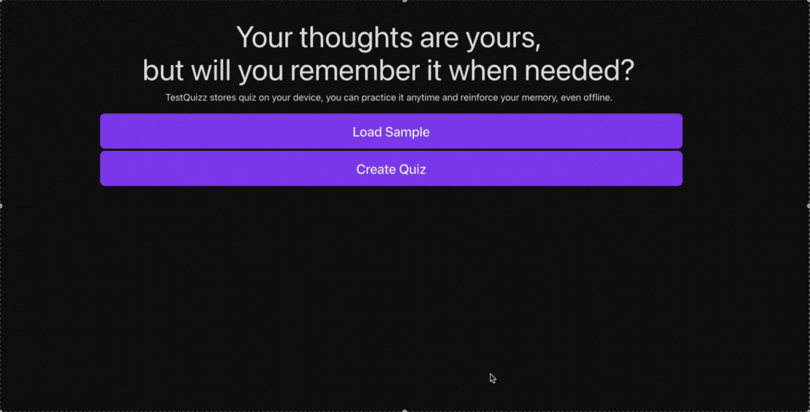

# Quiz App 
- This app is still in development phase. Working in logis rather than styles
 

# Did

- basic app that loads sample data
- can check answers when the answer is index with number or alphabet
- can extract questions from AikenFormat
- a create quiz page
- a toggle and timer component
- Actually working one will start using this and build more on it
- show right answer when you select wrong answer
- score board and recursive quizz
- result board
- a UI that show all user selected option and whether it is right or not.
- View Score or consecutive test -> next test will only contain wrong answered

# Do

- If show score at last use use radio button else use normal button
- Do random later first right flow
- Add sound for timer
- A start quizz maybe and in that we can choose show answer at last or not.
- a resizer
- quiz title and time
- a file upload and store it in top
- long term or short term memory toggle

